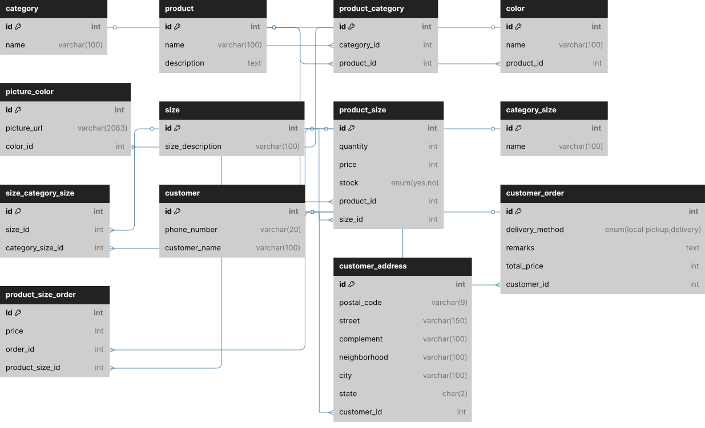

# Easylist
- [Easylist](#easylist)
- [Sobre o projeto  ℹ](#sobre-o-projeto--ℹ)
    - [Cenário Atual e Problema 🔴](#cenário-atual-e-problema-)
    - [Proposta da aplicação 🟢](#proposta-da-aplicação-)
- [Principais Objetivos técnicos 🛠️](#principais-objetivos-técnicos-️)
- [Tabelas do banco de dados 🗄️](#tabelas-do-banco-de-dados-️)
    - [1. categories](#1-categories)
    - [2. product\_category](#2-product_category)
    - [3. products](#3-products)
    - [4. color](#4-color)
    - [5. picture\_color](#5-picture_color)
    - [6. sizes](#6-sizes)
    - [7. product\_size](#7-product_size)
    - [8. category\_size](#8-category_size)
    - [9. size\_category\_size](#9-size_category_size)
    - [10. customer](#10-customer)
    - [11. customer\_address](#11-customer_address)
    - [12. customer\_order](#12-customer_order)
    - [13. product\_size\_order](#13-product_size_order)
- [Diagrama ER](#diagrama-er)
---
# Sobre o projeto  ℹ
### Cenário Atual e Problema 🔴
* Em períodos em que a loja tem muita demanda, o atendimento online, que é feito por whatsapp, é encerrado devido a dificuldade do atendente em lidar com as conversas no whatsapp ao mesmo tempo que lida com o alto número de clientes na loja física. 
---
### Proposta da aplicação 🟢

* Inicialmente, esta aplicação web irá servir como "primeiro contato" e fará a apresentação de opções, para que os clientes possam selecionar os itens que desejam comprar. Na finalização do pedido, os itens e seus detalhes (como por exemplo tamanho e cor) serão adicionados a uma lista contendo informações do cliente, forma de envio e meio de pagamento.

* Inicialmente, a finalização do pedido ainda será feita via whatsapp. Mas de acordo com o proprietário da loja, caso haja melhora com a implementação da aplicação, todo o checkout será feito pela aplicação e o whatsapp ficará apenas para suporte.
---
# Principais Objetivos técnicos 🛠️

* A escolha do PHP puro, é para que eu possa fazer todo o código da forma mais manual possível, e assim descobrir e entender como as coisas funcionam "por debaixo dos panos".

* Aplicar os conceitos de SOLID, pois acredito que são o conjunto de boas práticas mais importante na orientação a objetos.

* Desenvolver a aplicação pensando em evitar o acoplamento para facilitar manutenção e a implementação de testes automatizados.

* Implementar testes automatizados. Na minha visão, a testabilidade é um dos pilares mais importantes no desenvolvimento de software.

* Realizar o deploy da aplicação. Até o momento, a AWS (free tier) é a escolha de plataforma que será utilizada.

* Documentar toda a aplicação para ter uma visão geral sobre o que cada coisa faz, para o que foi feito, como foi implementado e por quê. Acredito que isso vai servir tanto para resolver problemas quanto para fazer melhorias no futuro.

* Aprender sobre Github Actions e implementar uma esteira de deploy CI/CD.

---

# Tabelas do banco de dados 🗄️

### 1. categories
Tabela que armazena as categorias dos produtos.

| Campo  | Tipo   | Descrição |
|--------|--------|-----------|
| id     | INT (PK) | Identificador único da categoria |
| name   | VARCHAR(100) | Nome da categoria |

**Relacionamentos:**
- Relaciona-se com `products` através da tabela intermediária `product_category`.

---

### 2. product_category
Tabela intermediária que define o relacionamento muitos-para-muitos entre produtos e categorias.

| Campo       | Tipo   | Descrição |
|------------|--------|-----------|
| id         | INT (PK) | Identificador único |
| category_id| INT (FK) | Referência para `categories` |
| product_id | INT (FK) | Referência para `products` |

---

### 3. products
Tabela que armazena os produtos do sistema.

| Campo       | Tipo   | Descrição |
|-------------|--------|-----------|
| id          | INT (PK) | Identificador único do produto |
| name        | VARCHAR(100) | Nome do produto |
| description | TEXT | Descrição do produto |

**Relacionamentos:**
- Relaciona-se com `categories` via `product_category`
- Relaciona-se com `color`, `product_size`

---

### 4. color
Tabela que define cores associadas a produtos.

| Campo        | Tipo        | Descrição |
|--------------|-------------|-----------|
| id           | INT (PK)    | Identificador da cor |
| name         | VARCHAR(100)| Nome da cor |
| product_id   | INT (FK)    | Produto ao qual a cor pertence |

---

### 5. picture_color
Tabela que armazena imagens associadas a uma cor.

| Campo        | Tipo         | Descrição |
|--------------|--------------|-----------|
| id           | INT (PK)     | Identificador da imagem |
| picture_url  | VARCHAR(2083)| URL da imagem |
| color_id     | INT (FK)     | Cor à qual a imagem pertence |

---

### 6. sizes
Tabela de tamanhos disponíveis para produtos.

| Campo             | Tipo         | Descrição |
|------------------|--------------|-----------|
| id               | INT (PK)     | Identificador do tamanho |
| size_description | VARCHAR(100) | Descrição ou nome do tamanho |

---

### 7. product_size
Relação entre produtos e tamanhos, com estoque, preço e quantidade.

| Campo        | Tipo           | Descrição |
|--------------|----------------|-----------|
| id           | INT (PK)       | Identificador |
| quantity     | INT UNSIGNED   | Quantidade de produtos no pedido |
| price        | INT UNSIGNED   | Preço |
| stock        | ENUM('yes','no') | Indica se está disponível em estoque |
| product_id   | INT (FK)       | Produto relacionado |
| size_id      | INT (FK)       | Tamanho relacionado |

---

### 8. category_size
Categorias genéricas de tamanhos (ex: tamanhos de tênis, tamanhos de roupas).

| Campo  | Tipo        | Descrição |
|--------|-------------|-----------|
| id     | INT (PK)    | Identificador |
| name   | VARCHAR(100)| Nome da categoria de tamanho |

---

### 9. size_category_size
Relação entre tamanhos e suas categorias de tamanho.

| Campo              | Tipo     | Descrição |
|--------------------|----------|-----------|
| id                 | INT (PK) | Identificador |
| size_id            | INT (FK) | Tamanho relacionado |
| category_size_id   | INT (FK) | Categoria de tamanho relacionada |

---

### 10. customer
Tabela com os dados dos clientes.

| Campo           | Tipo         | Descrição |
|-----------------|--------------|-----------|
| id              | INT (PK)     | Identificador do cliente |
| phone_number    | VARCHAR(20)  | Telefone do cliente|
| customer_name   | VARCHAR(100) | Nome do cliente |

---

### 11. customer_address
Endereços associados aos clientes.

| Campo         | Tipo         | Descrição |
|---------------|--------------|-----------|
| id            | INT (PK)     | Identificador do endereço |
| postal_code   | VARCHAR(9)   | CEP |
| street        | VARCHAR(150) | Rua |
| complement    | VARCHAR(100) | Complemento |
| neighborhood  | VARCHAR(100) | Bairro |
| city          | VARCHAR(100) | Cidade |
| state         | CHAR(2)      | Estado |
| customer_id   | INT (FK)     | Cliente relacionado |

---

### 12. customer_order
Pedidos realizados pelos clientes.

| Campo            | Tipo                            | Descrição |
|------------------|----------------------------------|-----------|
| id               | INT (PK)                         | Identificador do pedido |
| delivery_method  | ENUM('local pickup', 'delivery') | Forma de entrega |
| remarks          | TEXT                             | Observações adicionais |
| total_price      | INT                              | Valor total |
| customer_id      | INT (FK)                         | Cliente que fez o pedido |

---

### 13. product_size_order
Tabela que vincula pedidos aos tamanhos de produtos selecionados.

| Campo              | Tipo     | Descrição |
|--------------------|----------|-----------|
| id                 | INT (PK) | Identificador |
| price              | INT      | Preço no momento do pedido |
| order_id           | INT (FK) | Pedido associado |
| product_size_id    | INT (FK) | Combinação de produto + tamanho selecionado |

# Diagrama ER

